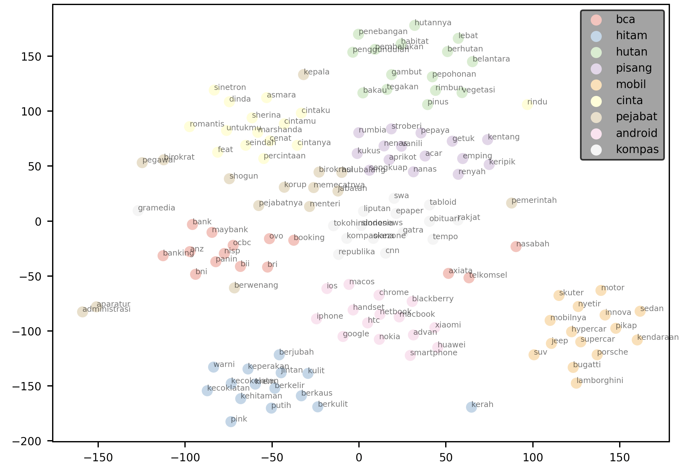

# Word Embedding utilities: Indonesian Language Models
[](https://badge.fury.io/py/elang) [](https://pypi.python.org/pypi/elang/) [](https://github.com/onlyphantom/elangdev) [](https://github.com/onlyphantom/elang/graphs/commit-activity) [](https://pypi.org/project/elang/https://pypi.org/project/elang/) [](https://pypi.org/project/elang/https://pypi.org/project/elang/)

Elang is an acronym that combines the phrases **Embedding (E)** and **Language (Lang) Models**. Its goal is to help NLP (natural language processing) researchers, Word2Vec practitioners and data scientists be more productive in training language models. By the 0.1 release [current version, 0.0.7](https://pypi.org/project/elang/https://pypi.org/project/elang/), the package will include:
- Visualizing Word2Vec models
    - 2D plot with emphasis on words of interest
    - 2d plot with neighbors of words
    - _More coming soon_
- Text processing utility
    - Remove stopwords (Indonesian)
    - Remove region entity (Indonesian)
    - Remove calendar words (Indonesian)
    - Remove vulgarity (Indonesian)
- Corpus-building utility
    - Build Indonesian corpus using wikipedia
    - Pre-trained model for quick experimentation


## Elang
Elang also means "eagle" in Bahasa Indonesia, and the _elang Jawa_ (Javan hawk-eagle) is the national bird of Indonesia, more commonly referred to as Garuda. 

The package provides a collection of utility functions and tools that interface with `gensim`, `matplotlib` and `scikit-learn`, as well as curated negative lists for Bahasa Indonesia (kata kasar / vulgar words, _stopwords_ etc) and useful preprocesisng functions. It abstracts away the mundane task so you can train your Word2Vec model faster, and obtain visual feedback on your model more quickly.

# Quick Demo

### 2-d Word Embedding Visualization
Install `elang`:
```bash
pip install elang
```

Performing word embeddings in **4 lines of code** gets you a visualization:
```py
from elang.plot.utils import plot2d
from gensim.models import Word2Vec

model = Word2Vec.load("path.to.model")
plot2d(model)
```
Output:


It even looks like a soaring eagle with its outstretched wings!

### Visualizing Neighbors in 2-dimensional space

`elang` also includes visualization methods to help you visualize a user-defined _k_ number of neighbors to each words. When `draggable` is set to `True`, you will obtain a legend that you can move around in the resulting plot.

```py
words = ['bca', 'hitam', 'hutan', 'pisang', 'mobil', "cinta", "pejabat", "android", "kompas"]

plotNeighbours(model, 
    words, 
    method="TSNE", 
    k=15,
    draggable=True)
```



## Scikit-Learn Compatability
Because the dimensionality reduction procedure is handled by the underlying `sklearn` code, you can use any of the valid [parameters](https://scikit-learn.org/stable/modules/generated/sklearn.manifold.TSNE.html) in the function call and they will be handed off to the underlying method. Common examples are the `perplexity`, `n_iter` and `random_state` parameters:

```py
model = Word2Vec.load("path.to.model")
bca = model.wv.most_similar("bca", topn=14)
similar_bca = [w[0] for w in bca]
plot2d(
    model,
    method="PCA",
    targets=similar_bca,
    perplexity=20,
    early_exaggeration=50,
    n_iter=2000,
    random_state=0,
)
```

Output:

